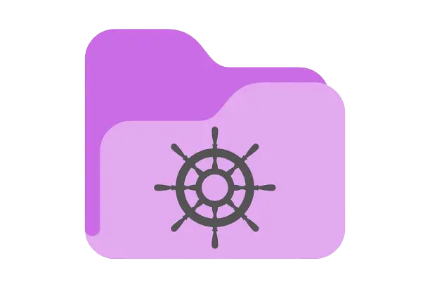

# FolderHarbor 

A powerful, multi-protocol file server with Role-Based Access Control (RBAC). \
This project was made for Hack Club [Flavortown](https://flavortown.hackclub.com)!
## Highlights
FolderHarbor is a powerful file server, designed in a multi-component "stack" style. \
Some cool things it features:
- Multiple protocols (WebDAV and FTP), supporting macOS, Windows, and most Linux file managers (no extra software needed for these!)
- Role-Based Access Control, granular permissions, and Access Control Lists, letting you manage security exactly how you want
- Detailed, highly specific audit logging
## Components
### Server &ensp;[ [Info](https://fh.novatea.dev/server) | [README](https://github.com/aelithron/folderharbor/blob/main/server/README.md) | [Source](https://github.com/aelithron/folderharbor/tree/main/server) ]
The server is the core of FolderHarbor. This provides the admin API, WebDAV, and FTP support. \
You can install this with a simple command on a Linux device: `curl -fsSL https://fh.novatea.dev/install.sh | sudo bash` \
There's also some extra setup info in the [server README](https://github.com/aelithron/folderharbor/blob/main/server/README.md#setup).
### CLI &ensp;[ [Info/Download](https://fh.novatea.dev/cli) | [README](https://github.com/aelithron/folderharbor/blob/main/cli/README.md) | [Source](https://github.com/aelithron/folderharbor/tree/main/cli) ]
The CLI is a fast way to administer and work with a FolderHarbor server. \
It's written in Go for extra optimization and cross-platform support, and commands execute extremely quickly. \
I'd suggest checking out the [CLI README](https://github.com/aelithron/folderharbor/blob/main/cli/README.md) for command information.
### Web Panel &ensp;[ [Info](https://fh.novatea.dev/web) | [Live](https://demo.fh.novatea.dev) | [README](https://github.com/aelithron/folderharbor/blob/main/web/README.md) | [Source](https://github.com/aelithron/folderharbor/tree/main/web) ]
The web panel lets you work with and administer FolderHarbor servers, through a beautiful, intuitive interface. \
Compatible with any modern browser, and even with mobile ones, it keeps admin and user access easy and convenient :3 \
You can use the [hosted panel](https://demo.fh.novatea.dev) run by me, or run your own with [the Docker image](https://github.com/aelithron/folderharbor/blob/main/web/README.md#setup). \
There's also some usage examples in the [web README](https://github.com/aelithron/folderharbor/blob/main/web/README.md)!
## Extras
### Landing Page &ensp;[ [Live](https://fh.novatea.dev) | [README](https://github.com/aelithron/folderharbor/blob/main/landing/README.md) | [Source](https://github.com/aelithron/folderharbor/tree/main/landing) ]
This is a page to give information and download links for the other components! All of the "info" links on the above ones use this page. \
You likely don't need to set this up, but I [offer](https://github.com/aelithron/folderharbor/blob/main/landing/README.md#deploying) it if you want to (say, if you want an internal way to reference it)!
